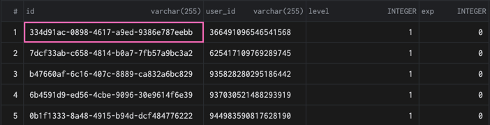

# Database

---
Voici la partie qui sera nécessaire pour que le bot puisse stocker les données importantes aux 
modules. Le système fonctionne par un `model` et une `migration`.

Sur chacunes des tables, chaques lignes peut-être identifié par son `uuid v4` qui est unique, 
(en d'autres termes aucunes autres lignes n'aura le même id !)

